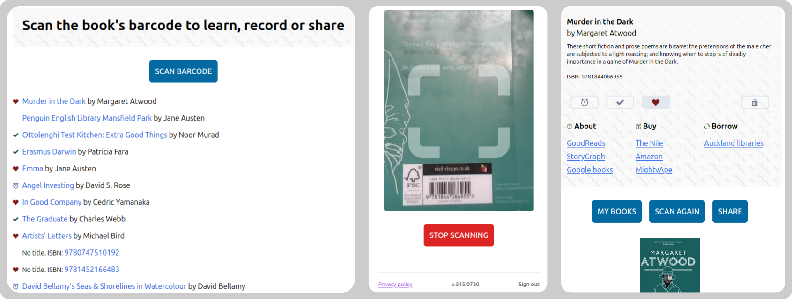
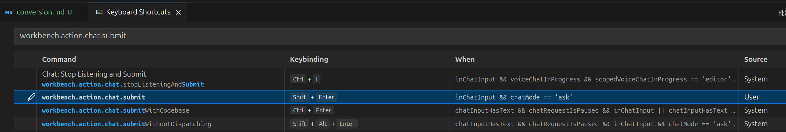
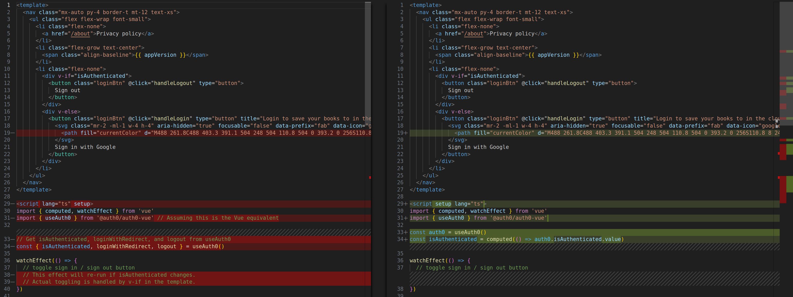

# React to Vue Conversion with Claude, Gemini, and ChatGPT

This post covers converting my [book reading tracker app](https://github.com/rimutaka/bookwormfood) from React to Vue using GitHub Copilot Pro in VSCode.

**Project size:**  
- 8 JSX components  
- 8 asset files (TailwindCSS, images)  
- 4 WASM files  
- index.js  
The app has only 3 screens, so it is quite an uncomplicated project.



## Online React to Vue Converters

All online tools offering React to Vue conversion that came up on page one in Google produced unusable garbage.
It was not good enough even for a boilerplate.

I DO NOT recommend any of these tools:

- https://tools.w3cub.com/react-to-vue
- https://www.gitloop.com/tool/react-to-vue
- https://syntha.ai/converters/react-to-vue
- https://www.yeschat.ai/gpts-9t557tdtLqi-Code-Transformer-Vue-to-React-and-Vice-Versa
- https://chatgpt.com/g/g-4TxR4JVBe-react-vue-converter

## GitHub Copilot

GitHub Copilot is the default AI Chat choice for VSCode.
You may also consider using [Cursor](https://www.cursor.com/en) or [Claude Code](https://docs.anthropic.com/en/docs/claude-code/overview).

If you are new to using [Co-Pilot Chat window in VSCode](https://code.visualstudio.com/docs/copilot/chat/copilot-chat), there is one customization I highly recommend - disable _Send on Enter_ setting to enter _multiline prompts_.

- Open _Keyboard Shortcuts_ (`Ctrl-K` + `Ctrl-S`)
- Search for `workbench.action.chat.submit`
- Change from `Enter` to `Shift+Enter` or any other key combination you like



More info:  
- https://github.com/orgs/community/discussions/86624
- https://code.visualstudio.com/docs/configure/keybindings#_keyboard-shortcuts-editor

## Converting the Entire Project 🙄

Attempts to convert the entire project in one go failed.
All the models clearly prefer the user to break it down into smaller steps, e.g. create scaffolding, improve it, add linters, NPM packages and then convert the components one by one.

I could have asked the LLM for the action plan, correct it and then ask to execute.
Doing the conversion in small steps seemed like a better approach.

## Converting a Single React Component 🎉

My `NavBar` component had only 71 lines of code and used a single dependency, `useAuth0` from `@auth0/auth0-react` for authentication.

Full file: https://github.com/rimutaka/bookwormfood/blob/react-to-vue-conv/vue/src/components/conv/navbar.js

### Prompt

It took me a few attempts to come up with a prompt that produced a meaningful conversion with `navbar.js` as the context:

```
Convert the current react component into a VueJS component to go into an existing app structure.
Assume that any functions, objects or APIs called from the component exist somewhere.
Copy comments as-is.
Use TypeScript, VueJS composition API.
```

I asked ChatGPT to improve it. The new prompt was more readable, but made no difference to the end result - all models produced the same output for both.
```
Convert the provided React component into a Vue 3 Single File Component that fits into an existing Vue application structure.

Use TypeScript and the VueJS Composition API.
Preserve all comments exactly as they appear in the original code.
Assume that any external functions, objects, or APIs referenced in the component are available elsewhere in the project.
Ensure the resulting Vue component is idiomatic and ready for integration into a typical Vue app.
```

### Claude 3.7 Sonnet

The worst result of them all:
- didn't follow the composition API structure
- left placeholders
- unusual formatting

Vue file: https://github.com/rimutaka/bookwormfood/blob/react-to-vue-conv/vue/src/components/conv/Claude37Sonnet.vue

### Claude 3.5 Sonnet

A much better result with a few minor issues:
- `window.location.port == 80` should be `"80"` in TypeScript
- `process.env.VUE_APP_BUILD_TS` should be `import.meta.env.VITE_APP_BUILD_TS`
- inconsistent use of `''` and `""`

Vue file: https://github.com/rimutaka/bookwormfood/blob/react-to-vue-conv/vue/src/components/conv/Claude35Sonnet.vue

### Gemini 2.5 Pro

A very similar result to Claude 3.5 Sonnet.

The `<template>` part was nearly identical with only syntactical and formatting differences for the rest of the code.



Vue file: https://github.com/rimutaka/bookwormfood/blob/react-to-vue-conv/vue/src/components/conv/Gemini25Pro.vue

### ChatGPT-4.1

A nearly identical result to Claude 3.5 Sonnet and Gemini 2.5 Pro.

Vue file: https://github.com/rimutaka/bookwormfood/blob/react-to-vue-conv/vue/src/components/conv/ChatGPT41.vue

## Conclusion

No clear winner - I used Claude, Gemini, and ChatGPT interchangeably.

The LLMs did about 80% of the work. 
The converted code was mostly correct, but not production-ready.

The full conversion took me 2 days including unrelated bug fixes.

From this React:
[https://github.com/rimutaka/bookwormfood/tree/54f949b...](https://github.com/rimutaka/bookwormfood/tree/54f949bb58dd428fd35f0ff001ac14cfce290395/src)  

To this Vue:
[https://github.com/rimutaka/bookwormfood/tree/28e52c2...](https://github.com/rimutaka/bookwormfood/tree/28e52c26849fb5274bb8f0de9aa55b585da20128/vue/src)

### Question 

Could one of these _brilliant golden retrievers on acid_ completely replace me for this task?

**Not yet.**